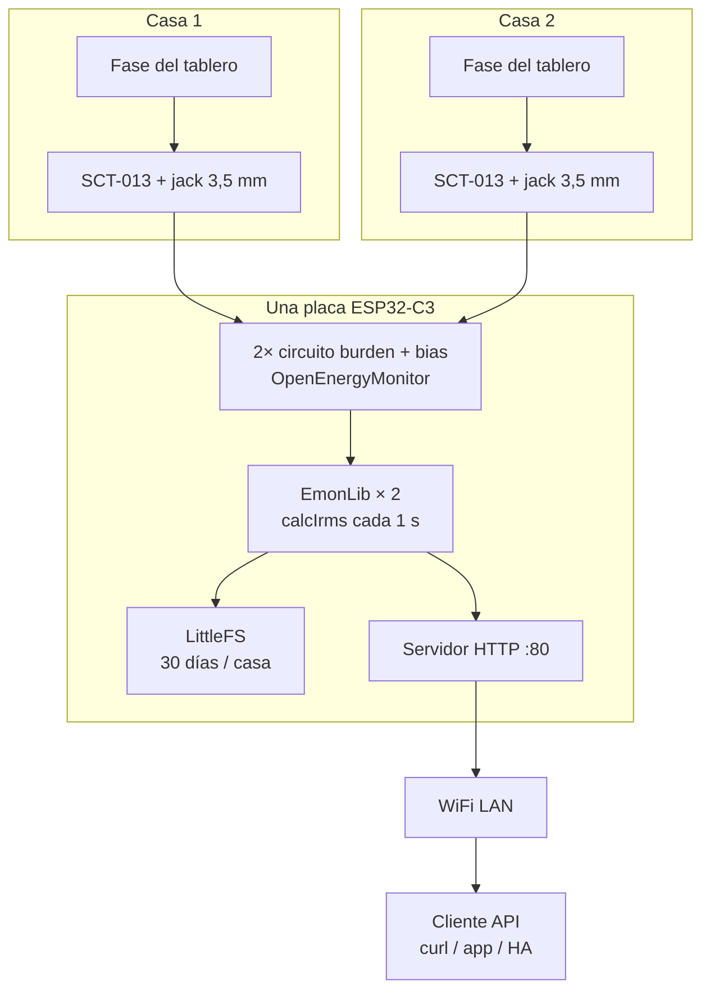

# Medidor de corriente — 2 viviendas, 1 placa

Monitor de energía **no invasivo** para dos casas: dos sensores **YHDC SCT-013** (uno por tablero) y **un solo ESP32-C3 SuperMini** que mide, acumula kWh y expone una **API REST (JSON)** por WiFi. Sin pantalla local. Histórico diario persistido **≥ 30 días** en flash.

El diseño sigue el enfoque de [OpenEnergyMonitor](https://openenergymonitor.org/) y el tutorial [DIY Home Energy Monitor (Savjee)](https://savjee.be/2019/07/DIY-home-energy-monitor-with-ESP32/), adaptado a **dos canales** y almacenamiento **local** (sin AWS).

## Documentación

| Documento | Contenido |
|-----------|-----------|
| [docs/01-hardware.md](docs/01-hardware.md) | BOM, cableado tipo Savjee, jacks 3,5 mm, 2× front-end |
| [docs/02-software.md](docs/02-software.md) | **EmonLib**, medición cada 1 s, API REST |
| [docs/03-almacenamiento-y-api.md](docs/03-almacenamiento-y-api.md) | LittleFS, API REST, retención 1 mes |
| [docs/04-plan-implementacion.md](docs/04-plan-implementacion.md) | Fases de montaje y firmware |

## Diagrama del sistema

## Piezas clave (resumen)

| Pieza | Rol |
|-------|-----|
| **ESP32-C3 SuperMini** | Único MCU: 2 entradas ADC, WiFi, servidor |
| **2× SCT-013 100 A** | Transformador de corriente; pinza en la fase de cada casa |
| **EmonLib** | Convierte la onda AC del ADC en **I_rms (A)** |
| **Burden + divisor** | Igual que en el tutorial Savjee (ver hardware) |
| **LittleFS** | kWh por día y por casa durante 1 mes |
| **LED rojo (GPIO2)** | Parpadeo = sin red; fijo = sin corriente; apagado = OK |

## Diferencias respecto al tutorial original

| Tutorial Savjee (1 vivienda) | Este proyecto |
|------------------------------|---------------|
| 1× SCT, 1× ADC (GPIO 34) | **2× SCT**, GPIO0 y GPIO1 |
| Envío a **AWS IoT** (MQTT) | **API REST** (JSON) + archivos en flash |
| LCD I2C local | **Sin pantalla**; solo API por WiFi |
| SCT-013-**030** (30 A) | SCT-013 **100 A / 50 mA** (ajuste de burden y calibración) |

## Referencias

- [OpenEnergyMonitor — CT sensors](https://learn.openenergymonitor.org/electricity-monitoring/ct-sensors)
- [Savjee — DIY Home Energy Monitor](https://savjee.be/2019/07/DIY-home-energy-monitor-with-ESP32/)
- [EmonLib](https://github.com/openenergymonitor/EmonLib)

## Próximo paso

[Plan de implementación](docs/04-plan-implementacion.md): protoboard → un canal con EmonLib → dos canales → WiFi + API.
