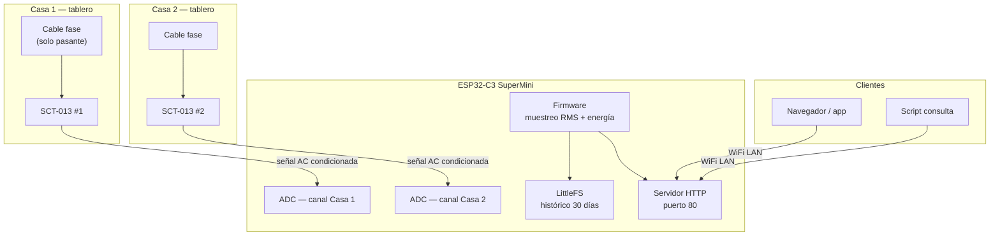

# Medidor de corriente — 2 viviendas

Proyecto IoT para medir el consumo eléctrico de **dos casas** con sensores de corriente inductivos **SCT-013 100 A** y un microcontrolador **ESP32-C3 SuperMini** (16 pines). El dispositivo expone un **servidor HTTP** con mediciones en tiempo real e histórico diario, con **persistencia local de al menos 30 días**.

## Documentación

| Documento | Contenido |
|-----------|-----------|
| [docs/01-hardware.md](docs/01-hardware.md) | Esquema eléctrico, lista de materiales, montaje y seguridad |
| [docs/02-software.md](docs/02-software.md) | Arquitectura de firmware, servidor web, calibración |
| [docs/03-almacenamiento-y-api.md](docs/03-almacenamiento-y-api.md) | Modelo de datos, API REST, retención de 1 mes |
| [docs/04-plan-implementacion.md](docs/04-plan-implementacion.md) | Fases, pruebas y checklist |

## Diagrama general del sistema

## Decisión de plataforma

| Criterio | ESP32-C3 SuperMini (16 pines) | ESP32 clásico NodeMCU |
|----------|-------------------------------|------------------------|
| Costo | Menor | Mayor |
| Pines / ADC | 2 ADC útiles (suficiente para 2 SCT) | Más ADC y GPIO |
| WiFi | 802.11 b/g/n | 802.11 b/g/n |
| Consumo | Menor | Mayor |
| **Recomendación** | **Sí — opción preferida** | Reserva si necesitás SD externa o más sensores |

## Resumen de requisitos cubiertos

- **2 medidas independientes** (una por casa).
- **Servidor embebido** con estado actual e histórico diario.
- **Persistencia ≥ 1 mes** en flash (LittleFS), con agregados por día (kWh).
- **Sin dependencia de nube** en la versión base (opcional: backup MQTT más adelante).

## Próximo paso

Seguir el [plan de implementación](docs/04-plan-implementacion.md) empezando por el banco de pruebas en mesa (sin tensión de red) y luego el montaje con SCT en un cable de prueba.
