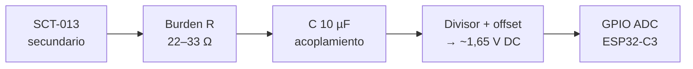
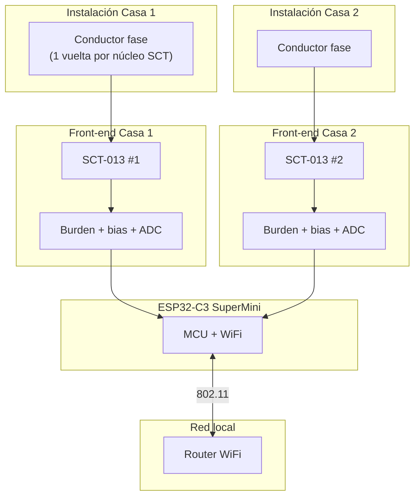

# Hardware

## 1. Lista de materiales (BOM)


| Cant. | Componente                                       | Notas                                                              |
| ----- | ------------------------------------------------ | ------------------------------------------------------------------ |
| 1     | **NodeMCU ESP32-C3 SuperMini** (16 pines, USB-C) | Controlador principal + WiFi                                       |
| 2     | **SCT-013 100 A / 50 mA**                        | Uno por casa; salida de corriente proporcional                     |
| 2     | **Resistencia de carga (burden)** ~22–33 Ω, 1 W  | Convierte corriente del SCT en tensión medible                     |
| 2     | **Condensador electrolítico 10 µF**              | Filtro en la etapa de condicionamiento                             |
| 4     | **Resistencia 10 kΩ** (1/4 W)                    | Divisor / offset para centrar señal en ~1,65 V                     |
| 2     | **Diodos Schottky 1N5819** (opcional)            | Protección ante picos en entrada ADC                               |
| 1     | **Protoboard o PCB**                             | Montaje del front-end analógico                                    |
| —     | Cables, borneras, funda termorretráctil          | Según instalación                                                  |


### Opcional (fase 2)


| Componente                      | Uso                                                |
| ------------------------------- | -------------------------------------------------- |
| Módulo RTC DS3231               | Marca temporal si el ESP pierde hora tras reinicio |
| Tarjeta microSD + adaptador SPI | Backup o histórico > 30 días sin reescribir flash  |
| Caja IP65                       | Instalación en tablero o exterior                  |


---

## 2. Principio del SCT-013 100 A / 50 mA

- Relación de transformación aproximada: **1:2000** (100 A primario → 50 mA secundario).
- El secundario es **galvánicamente aislado** del conductor medido: no se corta la fase; el cable pasa por el núcleo del sensor.
- **Nunca** dejar el secundario en circuito abierto con carga conectada: usar siempre la resistencia de carga.

Corriente secundaria aproximada:


I_{sec} = \frac{I_{primario}}{2000}


Tensión en la burden (ej. R = 22 Ω):


V_{burden} = I_{sec} \times R


Ejemplo: 20 A en la casa → 10 mA secundario → **0,22 V** pico (antes de offset y amplificación).

---

## 3. Etapa de condicionamiento (por canal)

Cada SCT necesita el mismo circuito. La señal es **AC** centrada para el ADC del ESP32 (0–3,3 V, referencia 3,3 V).




### Esquema conceptual (un canal)

```
SCT-013 (secundario)
    |
   [Rb 22Ω] ----+---- ADC (GPIO0 o GPIO1 en C3)
                |
              [C 10µF]
                |
    3.3V --[10k]--+--[10k]-- GND   (bias ~1.65V en el nodo ADC)
```

**Pines ADC sugeridos en ESP32-C3 SuperMini:**


| Canal  | GPIO  | ADC      |
| ------ | ----- | -------- |
| Casa 1 | GPIO0 | ADC1_CH0 |
| Casa 2 | GPIO1 | ADC1_CH1 |


> Verificar el pinout exacto de tu placa; algunas variantes marcan los pines en la serigrafía.

### Ajuste de la burden

- Objetivo: pico de señal **< 1,0 V** respecto al offset (1,65 V) con la corriente máxima esperada en casa.
- Si la señal satura el ADC, subir R (ej. 33 Ω) o reducir ganancia en software.
- Calibrar con pinza amperimétrica o medidor de referencia.

---

## 4. Diagrama de conexión completo




### Cableado físico recomendado


| Desde             | Hacia                   | Cable                        |
| ----------------- | ----------------------- | ---------------------------- |
| Secundario SCT #1 | Entrada circuito Casa 1 | Par trenzado corto (< 30 cm) |
| Secundario SCT #2 | Entrada circuito Casa 2 | Idem                         |
| 3,3 V / GND ESP   | Front-ends              | GND común único              |


---

## 5. Seguridad e instalación

1. **Solo personal calificado** debe abrir tableros y pasar cables por los SCT.
2. Medir **una fase por casa** (monofásico) o adaptar firmware a **2 SCT por fase** si es trifásico (fuera del alcance inicial).
3. Mantener el ESP32 y el front-end **fuera** del borne de línea; señales de baja tensión únicamente.
4. Colocar fusible o automático dedicado si el equipo queda fijo en el tablero.
5. Etiquetar claramente: *Casa 1 / Casa 2* en cada SCT.

---

## 6. Dimensionamiento eléctrico (referencia Argentina 220 V)


| Magnitud           | Fórmula                                               | Ejemplo                                  |
| ------------------ | ----------------------------------------------------- | ---------------------------------------- |
| Potencia aparente  | P = V \times I                                        | 220 V × 10 A ≈ 2,2 kW                    |
| Energía diaria     | E = P \times t                                        | 2,2 kW × 24 h = 52,8 kWh/día             |
| Factor de potencia | Incluir `cos φ` en firmware si se mide solo corriente | P_{real} = V \times I \times \cos\varphi |


Sin medición de tensión, el firmware usará **tensión nominal configurable** (ej. 220 V) y opcionalmente factor de potencia por defecto (0,9–1,0) hasta instalar sensor de tensión (SCT-013 + divisor resistivo en fase, fase 2).

---

## 7. Montaje mecánico

1. Imprimir o fijar PCB/protoboard en caja con orificios para cables SCT.
2. Pasar **un solo** conductor por el núcleo (fase); no incluir neutro en el mismo núcleo si se busca medir corriente de línea.
3. Cerrar el núcleo del SCT hasta el clic; sin holgura.
4. Alejar el ESP32 de fuentes de calor del tablero; ventilación en caja.

---

## 8. Checklist hardware

- Dos SCT-013 identificados (Casa 1 / Casa 2)
- Dos circuitos burden + bias probados con multímetro (offset ~1,65 V sin carga)
- ESP32-C3 programable y operativo
- Señal senoidal visible en ADC con carga de prueba (lámpara o resistencia)
- WiFi conecta a la red doméstica
- Caja y etiquetas instaladas

