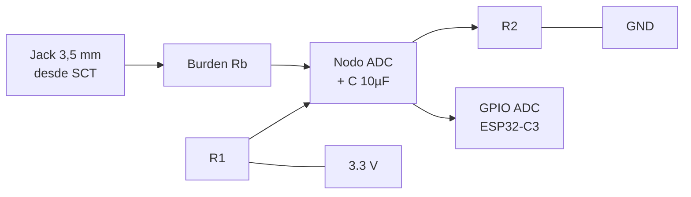
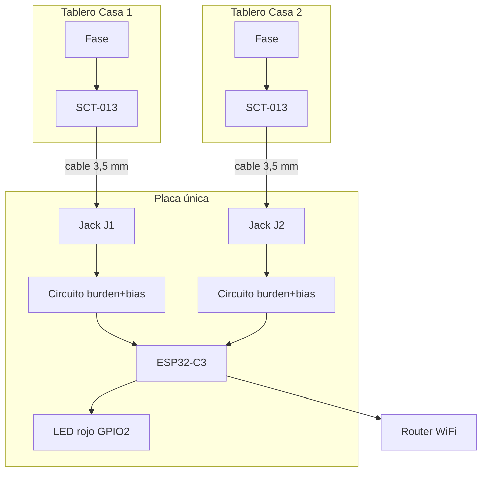

# Hardware

Basado en el cableado de [OpenEnergyMonitor](https://learn.openenergymonitor.org/electricity-monitoring/ct-sensors/connecting) y en el artículo [Savjee — DIY Home Energy Monitor](https://savjee.be/2019/07/DIY-home-energy-monitor-with-ESP32/). **Una sola placa ESP32-C3** con **dos circuitos idénticos** (uno por casa).

---

## 1. Lista de materiales (BOM)

| Cant. | Componente | Notas |
|------:|------------|-------|
| 1 | **ESP32-C3 SuperMini** (16 pines) | Único microcontrolador del proyecto |
| 2 | **SCT-013 100 A / 50 mA** (YHDC) | Uno por casa; conector **3,5 mm** en el cable |
| 2 | **Jack hembra 3,5 mm** (estéreo) | En la placa; permite desconectar cada SCT |
| 2 | **Resistencia de carga (burden)** | Ver §3; típ. **22 Ω** (1 W) para variant 100 A |
| 2 | **Condensador 10 µF** | En el nodo ADC (como en Savjee) |
| 4 | **Resistencias R1, R2** iguales | **10 kΩ–100 kΩ** (Savjee usa 2× 100 kΩ); R1=R2 por canal |
| 1 | **Protoboard o PCB** | Dos canales lado a lado |
| 1 | **Conectores hembra** para el ESP32 | No soldar el ESP directo (recomendación Savjee) |
| 1 | **LED rojo 5 mm** | Indicador de estado en caja |
| 1 | **Resistencia 220 Ω** (1/4 W) | Limitación de corriente del LED |
| — | Cables, caja | Según instalación |

### Opcional

| Componente | Uso |
|------------|-----|
| RTC DS3231 | Hora si NTP no está disponible |
| Caja con 2 orificios para jacks | Montaje final |

---

## 2. Instalación del SCT (por casa)

1. Identificar el **conductor de fase** en el tablero de esa casa (cable que entra al automático general).
2. Abrir el núcleo del SCT, pasar **solo ese cable** (una vuelta) y cerrar hasta el clic.
3. Conectar el cable del sensor al **jack 3,5 mm** de la placa etiquetado *Casa 1* o *Casa 2*.
4. **No cortar** la línea: medición no invasiva.

> En el tutorial original se pinza el cable principal del departamento. Aquí hay **dos tableros** (dos casas): cada SCT va en su tablero; ambos llegan a la **misma placa** ESP32.

---

## 3. Circuito de condicionamiento (por canal)

Réplica del esquema Savjee / OpenEnergyMonitor. **R1 y R2 deben ser iguales** (cualquier valor entre 10 kΩ y 470 kΩ; 100 kΩ es un buen punto de partida).



### Esquema textual (un canal — Casa 1 o Casa 2)

```
Jack 3,5 mm (secundario SCT)
    |-------- [Burden Rb] --------|
    |                              |
    +-------- nodo ADC --------+---→ GPIO (ADC)
    |              |           |
    |            [10 µF]       |
    |              |           |
   3.3V ---[R1]---+---[R2]--- GND
         (R1 = R2, ej. 100k)
```

- **Burden (`Rb`)**: convierte la corriente del secundario en tensión. Para **SCT-013 100 A / 50 mA**, OpenEnergyMonitor suele usar **22 Ω** (comprobar que el pico no sature el ADC a tu corriente máxima).
- **R1, R2**: polarizan el punto medio (~1,65 V en 3,3 V).
- **C 10 µF**: filtra / estabiliza el nodo (como en Savjee).

### Burden para SCT-013 100 A

| Parámetro | Valor |
|-----------|--------|
| Relación | ~1:2000 (100 A → 50 mA) |
| Rb típica | **22 Ω** (1 W) |
| Ajuste | Si el ADC satura, subir Rb (33 Ω) o bajar `calibration` en EmonLib |

---

## 4. Una placa, dos casas — pinout

| Casa | Jack en placa | GPIO ESP32-C3 | Uso |
|------|---------------|---------------|-----|
| Casa 1 | `J1` | **GPIO0** | `emon1.current(0, cal1)` |
| Casa 2 | `J2` | **GPIO1** | `emon2.current(1, cal2)` |
| LED estado | — | **GPIO2** | LED rojo externo (ver §5) |

**GND común** entre ambos front-ends y el ESP32.

> Verificar el pinout impreso en tu SuperMini; algunos clones rotan numeración.

### LED integrado vs LED rojo externo

Muchas placas **ESP32-C3 SuperMini** traen un LED **integrado** (suele ser **GPIO8**, a veces **activo en bajo**). Sirve para pruebas de placa, pero:

- Es pequeño y queda tapado dentro de la caja.
- No es rojo ni visible en la instalación.

Por eso el proyecto usa un **LED rojo externo en GPIO2**, montado en la carcasa y visible desde fuera.

### Por qué una sola placa alcanza

- Solo se necesitan **2 entradas ADC** analógicas.
- EmonLib procesa un canal por vez (`calcIrms`).
- WiFi y servidor HTTP corren en el mismo chip.
- El histórico de 30 días ocupa pocos KB en flash (no hace falta segunda placa).

---

## 5. LED rojo de estado (GPIO2)

Indicador **sin pantalla**: solo este LED resume el estado del equipo.

### Cableado

```
GPIO2 ──[ 220 Ω ]──|>|── GND
                    LED rojo (ánodo hacia GPIO2, cátodo a GND)
```

Lógica en firmware: **activo en alto** (`HIGH` = encendido).

### Comportamiento (prioridad)

| Prioridad | Condición | LED rojo |
|----------:|-----------|----------|
| **1 (más grave)** | Sin WiFi o sin IP (no hay red / no llega la API) | **Parpadeo** (~2 Hz) |
| 2 | Red OK, pero **sin corriente** en ambas casas | **Fijo encendido** |
| 3 | Red OK y corriente en al menos una casa | **Apagado** |

> Si hay fallo de red **y** sin corriente a la vez, gana el **parpadeo** (conexión es el problema más grave).

“Sin corriente” = \(I_{rms}\) de Casa 1 **y** Casa 2 por debajo de un umbral (ej. **0,15 A**), durante unos segundos, para filtrar ruido del ADC.

“Sin conexión” = `WiFi.status() != WL_CONNECTED` o sin IP asignada. Opcional en firmware: si hay WiFi pero **NTP no sincroniza** en X minutos, tratar también como fallo de conectividad a internet y **parpadear**.

---

## 6. Diagrama físico completo



### Montaje recomendado (orden Savjee)

1. **Breadboard**: un canal + lectura Serial (depuración).
2. **Protoboard**: dos canales + jacks; ESP en **zócalos hembra**.
3. **Instalación**: SCT en cada tablero; cables largos solo en baja tensión (salida del jack).

---

## 7. Seguridad

1. Solo **personal calificado** en tableros eléctricos.
2. **Una fase por casa** (monofásico 220 V).
3. Secundario del SCT **siempre** con burden conectada (nunca abierto en vacío con carga inductiva).
4. ESP y protoboard fuera de bornes de línea; señales ≤ 3,3 V.
5. Etiquetar jacks: *Casa 1*, *Casa 2*.

---

## 8. Potencia y energía (referencia)

Sin medidor de tensión en la fase (como Savjee):

\[
P\,(W) = I_{rms} \times V_{red}
\]

\[
kWh_{día} = \sum_{cada\;1s} \frac{P}{3600 \times 1000}
\]

`V_red` configurable en firmware (ej. **220 V** en Argentina).

---

## 9. Checklist hardware

- [ ] Dos SCT con jack; dos jacks hembra en la placa
- [ ] Dos circuitos idénticos (Rb, R1=R2, C 10 µF)
- [ ] Offset ~1,65 V en cada nodo ADC sin carga
- [ ] LED rojo + 220 Ω en **GPIO2**, visible en la caja
- [ ] ESP32-C3 en zócalos; programable
- [ ] Prueba con carga conocida en **un** canal antes de instalar el segundo SCT
- [ ] WiFi: hostname sugerido `esp32-medidor-2casas`
- [ ] Probar LED: parpadeo con WiFi apagado; fijo sin carga; apagado con carga
