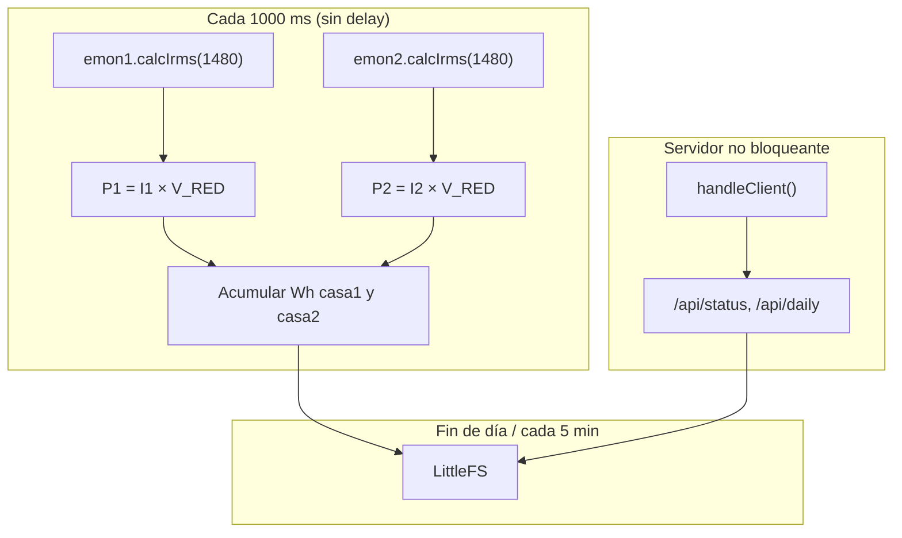
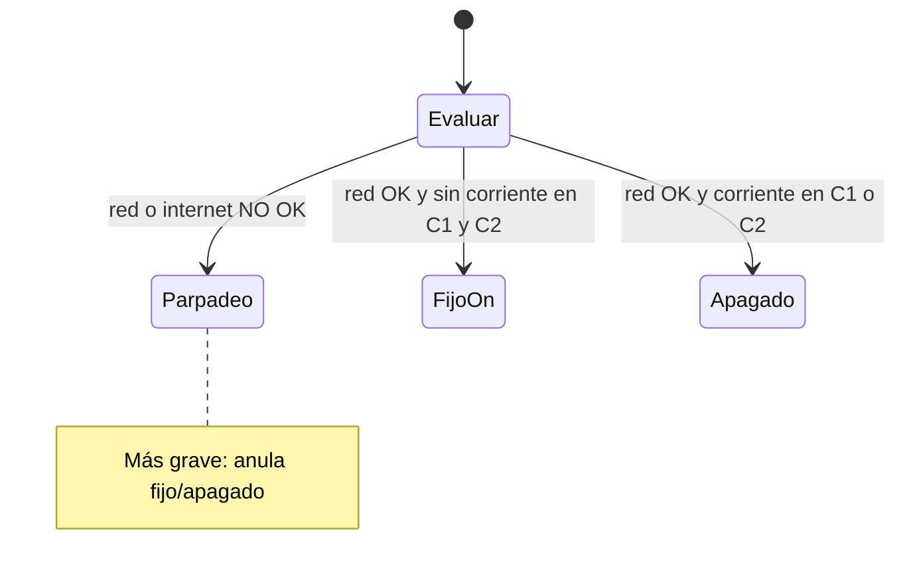

# Software

Firmware tipo **Savjee + EmonLib**, extendido a **dos canales** (`EnergyMonitor` × 2) en un **ESP32-C3**. Medición **cada 1 segundo** sin `delay()` en el bucle (para no bloquear el servidor HTTP).

---

## 1. Stack

| Componente | Uso |
|------------|-----|
| **Arduino** + core ESP32 | Framework |
| **[EmonLib](https://github.com/openenergymonitor/EmonLib)** | `calcIrms()` → amperios RMS |
| `WiFi.h` | Cliente STA |
| `WebServer` | API REST en LAN |
| **LittleFS** | Histórico 30 días |
| `ArduinoJson` | Respuestas API |

---

## 2. Arquitectura



---

## 3. EmonLib — dos casas, una placa

### Inicialización

```cpp
#include "EmonLib.h"

EnergyMonitor emon1;  // Casa 1
EnergyMonitor emon2;  // Casa 2

#define ADC_CASA1  0   // GPIO0
#define ADC_CASA2  1   // GPIO1
#define V_RED      220.0f
#define CAL_CASA1  30    // Ajustar en calibración (Savjee usa 30)
#define CAL_CASA2  30

// Resolución ADC (Savjee fuerza 10 bits en ESP32 clásico)
#define ADC_BITS    10
#define ADC_COUNTS  (1 << ADC_BITS)

void setupEmon() {
  analogReadResolution(ADC_BITS);
  // En ESP32-C3: configurar atenuación del canal si hace falta
  emon1.current(ADC_CASA1, CAL_CASA1);
  emon2.current(ADC_CASA2, CAL_CASA2);
}
```

### Bucle principal (patrón Savjee)

No usar `delay(1000)`. Medir solo si pasó 1 s desde la última muestra; el resto del tiempo atender WiFi y HTTP.

```cpp
unsigned long lastMeasure = 0;
unsigned long setupDoneAt = 0;
const unsigned long MEASURE_MS = 1000;
const unsigned long STARTUP_IGNORE_MS = 10000;

void loop() {
  unsigned long now = millis();

  if (now - lastMeasure >= MEASURE_MS) {
    lastMeasure = now;

  float i1 = emon1.calcIrms(1480);   // ~1 ciclo 50 Hz a alta tasa muestreo
  float i2 = emon2.calcIrms(1480);

    if (now - setupDoneAt > STARTUP_IGNORE_MS) {
      float w1 = i1 * V_RED;
      float w2 = i2 * V_RED;
      registrarMuestra(1, i1, w1);
      registrarMuestra(2, i2, w2);
      acumularEnergia(w1, w2, 1.0f);  // delta_t = 1 s
    }
  }

  updateStatusLed(i1, i2);  // no bloqueante; ver §8
  server.handleClient();
  tryReconnectWiFi();
}
```

> **Nota:** `calcIrms` es **bloqueante** (~decenas de ms). Con dos canales, una pasada completa cada 1 s es aceptable (como en el tutorial con MQTT + medición).

### Parámetro `1480`

Es el número de muestras que EmonLib promedia (Savjee). En 50 Hz suele cubrir varios ciclos. Si hay inestabilidad, probar valores cercanos según [documentación EmonLib](https://github.com/openenergymonitor/EmonLib).

---

## 4. Cálculo de kWh diarios

Igual criterio que Savjee (`watts = amps * HOME_VOLTAGE`), integrado en firmware:

| Variable | Descripción |
|----------|-------------|
| `wh_hoy_casa1` | Wh acumulados desde medianoche |
| `wh_hoy_casa2` | Idem casa 2 |
| `i_max_casaN` | Máximo I_rms del día |

Cada segundo:

\[
\Delta Wh = \frac{W_1 + W_2}{3600} \quad \text{(por canal por separado)}
\]

A medianoche (NTP): escribir JSON del día, resetear contadores, rotar 30 días (ver [03-almacenamiento-y-api.md](03-almacenamiento-y-api.md)).

---

## 5. Estructura del proyecto

```
firmware/
├── platformio.ini
├── src/
│   ├── main.cpp
│   ├── config.h           # WIFI, V_RED, CAL_CASA1/2, pines
│   ├── measurement.cpp    # EmonLib + acumulación Wh
│   ├── storage.cpp        # LittleFS
│   ├── web_server.cpp     # Rutas API HTTP
│   └── status_led.cpp     # LED rojo GPIO2
└── lib/
    └── EmonLib/
```

### `platformio.ini` (borrador)

```ini
[env:esp32-c3-devkitm-1]
platform = espressif32
board = esp32-c3-devkitm-1
framework = arduino
lib_deps =
    openenergymonitor/EmonLib
    bblanchon/ArduinoJson@^7
monitor_speed = 115200
```

---

## 6. WiFi

Patrón Savjee simplificado (sin deep sleep obligatorio):

```cpp
WiFi.mode(WIFI_STA);
WiFi.setHostname("esp32-medidor-2casas");
WiFi.begin(WIFI_SSID, WIFI_PASSWORD);
```

Mostrar IP en Serial al conectar (depuración).

---

## 7. Servidor HTTP (reemplazo de AWS del tutorial)

El tutorial envía 30 lecturas cada 30 s a **AWS IoT**. Este proyecto **guarda en la placa** y expone:

| Ruta | Función |
|------|---------|
| `GET /api/status` | W, A y kWh hoy por casa |
| `GET /api/today` | Totales del día |
| `GET /api/daily?casa=1&days=30` | Histórico |

Todas las salidas al exterior son **solo JSON por API** (sin interfaz local). Detalle en [03-almacenamiento-y-api.md](03-almacenamiento-y-api.md).

---

## 8. LED de estado (GPIO2)

### Configuración (`config.h`)

```cpp
#define PIN_LED_STATUS       2
#define NO_CURRENT_A         0.15f   // Umbral I_rms (A); calibrar en campo
#define NO_CURRENT_DEBOUNCE_S  30      // Segundos sin corriente antes de LED fijo
#define WIFI_BLINK_MS          250     // Parpadeo: 250 ms ON / 250 ms OFF
#define NTP_FAIL_BLINK_MIN     10      // Si NTP falla >10 min con WiFi OK → parpadeo
```

### Prioridad de estados



| Estado firmware | Condición | LED |
|-----------------|-----------|-----|
| `LED_NET_FAULT` | WiFi desconectado, sin IP, o NTP fallido (opc.) | Parpadeo |
| `LED_NO_CURRENT` | Red OK; `i1` y `i2` < umbral (debounce) | Fijo ON |
| `LED_OK` | Red OK; al menos un canal con corriente | OFF |

### Implementación de referencia

```cpp
enum LedMode { LED_OK, LED_NO_CURRENT, LED_NET_FAULT };

bool redOk() {
  return WiFi.status() == WL_CONNECTED && WiFi.localIP() != IPAddress(0, 0, 0, 0);
}

bool sinCorriente(float i1, float i2) {
  return i1 < NO_CURRENT_A && i2 < NO_CURRENT_A;
}

void updateStatusLed(float i1, float i2) {
  static unsigned long lastBlink = 0;
  static bool blinkOn = false;
  static unsigned long debounceStart = 0;

  pinMode(PIN_LED_STATUS, OUTPUT);

  // Prioridad 1: conexión (más grave)
  if (!redOk() || !ntpOk()) {
    if (millis() - lastBlink >= WIFI_BLINK_MS) {
      lastBlink = millis();
      blinkOn = !blinkOn;
      digitalWrite(PIN_LED_STATUS, blinkOn ? HIGH : LOW);
    }
    return;
  }

  // Prioridad 2: sin corriente en ambas casas
  if (sinCorriente(i1, i2)) {
    if (debounceStart == 0) debounceStart = millis();
    if (millis() - debounceStart >= NO_CURRENT_DEBOUNCE_S * 1000UL) {
      digitalWrite(PIN_LED_STATUS, HIGH);
      return;
    }
  } else {
    debounceStart = 0;
  }

  // Prioridad 3: todo bien
  digitalWrite(PIN_LED_STATUS, LOW);
}
```

`ntpOk()` devuelve `true` si la hora se sincronizó por NTP en los últimos `NTP_FAIL_BLINK_MIN` minutos (proxy de “hay internet”).

Llamar `updateStatusLed()` en cada `loop()`, **fuera** del bloque de medición de 1 s, para que el parpadeo sea fluido.

El mismo estado se expone en `GET /api/status` como `led_mode`, `red_ok` y `ntp_ok`.

---

## 9. Calibración (como Savjee)

1. Instalar con carga estable (calentador, horno).
2. Medir corriente real con pinza o medidor de referencia.
3. Ajustar `CAL_CASA1` y `CAL_CASA2` hasta que `emonN.calcIrms` coincida.
4. Guardar en **NVS** (`Preferences`) para no perder tras reinicio.

Constante inicial **30** (valor del tutorial); casi seguro habrá que retocarla para SCT-013 **100 A** y tu burden.

---

## 10. Confiabilidad

| Tema | Acción |
|------|--------|
| Lecturas erráticas al arranque | Ignorar primeros **10 s** (Savjee) |
| Reinicio | Snapshot `casaN_current.json` cada 5 min |
| WiFi caído | Parpadeo LED; seguir midiendo; reconectar en `loop` |
| Dos `calcIrms` seguidos | Mantener período ≥ 1 s entre rondas |

---

## 11. Pruebas

| # | Prueba | OK si |
|---|--------|--------|
| 1 | Un canal, Serial | I_rms estable con lámpara |
| 2 | Dos canales | C1 y C2 independientes |
| 3 | 24 h bench | kWh coherente con \(P \times t\) |
| 4 | API | JSON con 2 casas |
| 5 | Día 31 simulado | Se borra el más antiguo |
| 6 | LED | Parpadeo sin WiFi; fijo sin carga; apagado con carga |

---

## 12. Extensión futura (estilo Savjee V2 / cloud)

- MQTT a Home Assistant o InfluxDB (batch de 30 muestras como Savjee).
- Reconocimiento de patrones por electrodoméstico.
- Sensor de tensión (ZMPT101B) para \(P = V \times I\) real.

La **v1** no requiere cuenta AWS ni DynamoDB.
