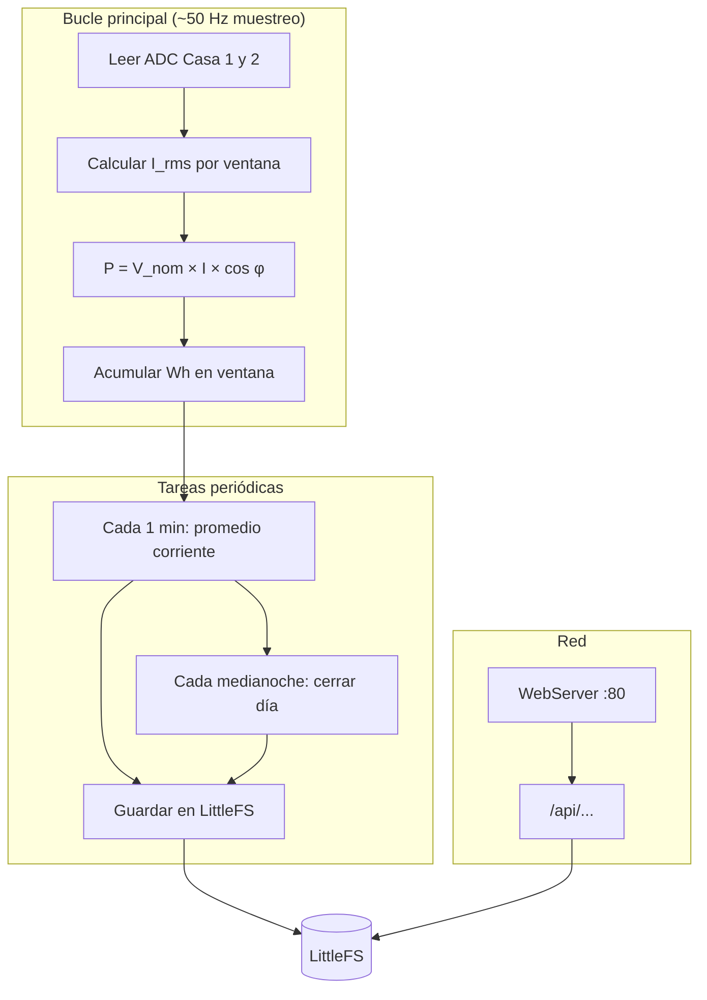
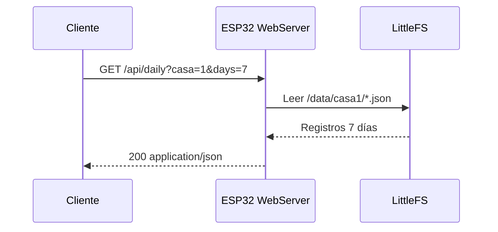

# Software

## 1. Stack tecnológico

| Capa | Tecnología | Motivo |
|------|------------|--------|
| Firmware | **Arduino framework** + board `esp32-c3-devkitm-1` | Rápido desarrollo, librerías ADC/WiFi |
| Alternativa | ESP-IDF | Mayor control; más complejo |
| WiFi | `WiFi.h` (modo STA) | Conexión a router doméstico |
| Servidor HTTP | `WebServer` o `ESPAsyncWebServer` | API REST + página simple |
| Persistencia | **LittleFS** | Archivos diarios en flash interna |
| Tiempo | `configTime()` NTP + `time.h` | Fechas para agregados diarios |
| JSON | `ArduinoJson` | Respuestas API y archivos |

---

## 2. Arquitectura de firmware



### Módulos del código (estructura de carpetas futura)

```
firmware/
├── src/
│   ├── main.cpp
│   ├── config.h              # WiFi, V_nominal, calibración
│   ├── adc_sampler.cpp       # Muestreo y RMS
│   ├── energy_meter.cpp      # Integración Wh / kWh
│   ├── storage.cpp           # LittleFS lectura/escritura
│   ├── web_server.cpp        # Rutas HTTP
│   └── time_service.cpp      # NTP y fecha local
├── data/                     # (opcional) archivos estáticos web
└── platformio.ini            # o sketch Arduino
```

---

## 3. Algoritmo de medición

### 3.1 Muestreo y RMS

Para cada canal, durante una ventana de **N muestras** (ej. 1 ciclo de 50 Hz → 20 ms → 1000 muestras a ~50 kHz no es viable en C3; usar **2–4 kHz** efectivos):

1. Leer ADC con offset restado.
2. Calcular \(I_{rms} = \sqrt{\frac{1}{N}\sum x_i^2}\).
3. Aplicar factor de calibración `cal_gain` y offset `cal_offset` por canal.

### 3.2 Potencia y energía

\[
P_{instantánea} = V_{nominal} \times I_{rms} \times \cos\varphi
\]

\[
\Delta Wh = P \times \Delta t_{horas}
\]

Acumular `Wh` en variable `energy_wh_today[casa]`.

### 3.3 Cierre del día

A las **00:00** (hora local Argentina UTC-3 configurable):

1. Persistir registro del día: `{ fecha, casa_id, kwh, imax, iavg }`.
2. Reiniciar acumuladores diarios.
3. Ejecutar rotación de archivos > 30 días.

---

## 4. Configuración (`config.h` ejemplo)

```cpp
#define WIFI_SSID       "tu_red"
#define WIFI_PASSWORD   "tu_clave"

#define V_NOMINAL       220.0f
#define POWER_FACTOR    0.95f

#define SAMPLE_RATE_HZ  2000
#define RMS_WINDOW_MS   200

#define TZ_OFFSET_SEC   (-3 * 3600)   // Argentina
#define NTP_SERVER      "pool.ntp.org"

#define ADC_PIN_CASA1   0
#define ADC_PIN_CASA2   1

#define BURDEN_OHMS     22.0f
#define SCT_RATIO       2000.0f
```

---

## 5. Servidor HTTP embebido

### 5.1 Endpoints previstos

Ver detalle en [03-almacenamiento-y-api.md](03-almacenamiento-y-api.md).

| Método | Ruta | Descripción |
|--------|------|-------------|
| GET | `/` | Dashboard HTML mínimo |
| GET | `/api/status` | Corriente y potencia instantánea |
| GET | `/api/daily?casa=1&days=30` | Histórico diario |
| GET | `/api/today` | Consumo acumulado hoy (ambas casas) |
| POST | `/api/calibrate` | Ajuste de ganancia (protegido, opcional) |

### 5.2 Diagrama de secuencia (consulta histórico)



---

## 6. Interfaz web mínima (fase 1)

Página servida desde flash (`/index.html` en LittleFS o embebida como `PROGMEM`):

- Tarjetas: **Casa 1** y **Casa 2** — corriente (A), potencia (W), kWh hoy.
- Gráfico de barras simple (últimos 7–30 días) vía fetch a `/api/daily`.
- Actualización automática cada 5–10 s (`/api/status`).

No requiere internet; solo LAN.

---

## 7. Calibración

1. **Offset**: sin carga, promediar ADC → `cal_offset`.
2. **Ganancia**: con carga conocida (calentador, etc.), comparar con pinza o medidor comercial → ajustar `cal_gain`.
3. Guardar constantes en **NVS** (`Preferences`) para sobrevivir reinicios.
4. Endpoint opcional `POST /api/calibrate` solo en modo instalación (PIN o token).

---

## 8. Confiabilidad

| Riesgo | Mitigación |
|--------|------------|
| Reinicio ESP | NVS + LittleFS; recuperar día parcial desde último guardado cada 5 min |
| Pérdida WiFi | Seguir muestreando; reconectar en background |
| Flash llena | Rotación estricta a 30 días; logs compactos |
| Hora incorrecta | NTP al boot; RTC opcional |

### Guardado periódico

Cada **5 minutos** escribir snapshot del día en curso:

`/data/casa1_current.json` → evita perder todo el día si hay corte de luz.

---

## 9. Herramientas de desarrollo

- **PlatformIO** (recomendado) o Arduino IDE 2.x
- Board: `esp32-c3-devkitm-1`
- Partition scheme: **Default 4MB with spiffs** → migrar a **LittleFS** (~1,5 MB para datos)
- Monitor serie 115200 baud para depuración

### Partition sugerida (platformio.ini)

```ini
board_build.partitions = default.csv
; o custom: app 1.5MB, littlefs 1.5MB
```

---

## 10. Pruebas de software

| Prueba | Criterio de éxito |
|--------|-------------------|
| Bench sin WiFi | RMS estable con lámpara |
| WiFi + NTP | Fecha correcta en logs |
| API `/api/status` | JSON válido, 2 canales |
| Simular medianoche | Archivo diario creado, contador reiniciado |
| 30 días simulados | Rotación borra día 31 |
| Corte alimentación | Recupera kWh parcial del día |
