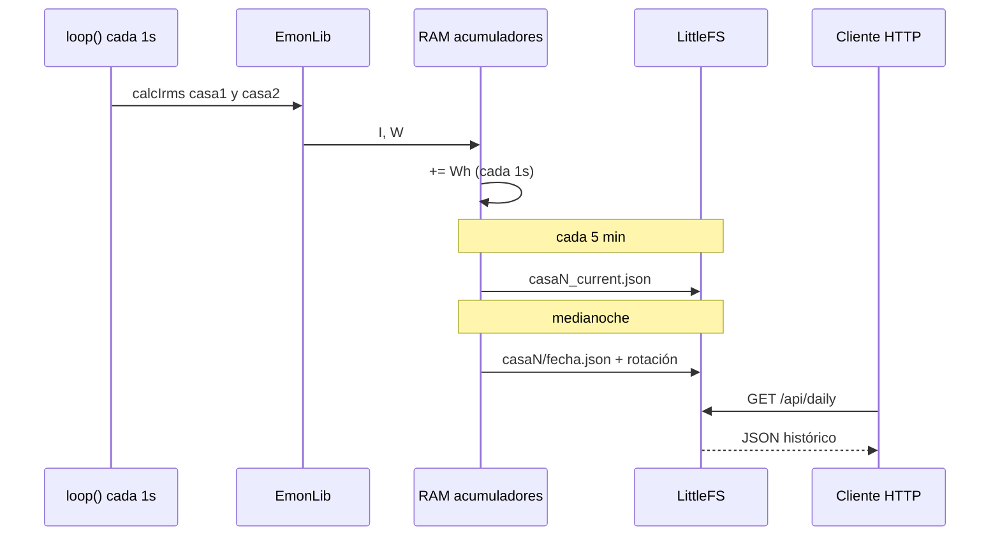

# Almacenamiento y API

Persistencia **en la misma placa ESP32** (no en la nube). El tutorial Savjee archivaba lecturas cada segundo en AWS; aquí se **agrega por día** en LittleFS para cumplir **≥ 30 días × 2 casas** sin saturar la flash.

---

## 1. Qué se guarda

| Dato | Frecuencia medición | Frecuencia guardado |
|------|---------------------|---------------------|
| W, A instantáneos | **1 s** (EmonLib) | Solo en RAM / API en vivo |
| kWh, I_avg, I_max del día | — | **1 archivo/día/casa** |
| Día en curso (parcial) | — | Cada **5 min** (`casaN_current.json`) |

No se almacenan las 2 592 000 muestras/mes por casa (como haría un CSV en S3 al estilo Savjee); solo el **resumen diario**, suficiente para “¿cuánto consumió cada casa por día?”.

### Espacio estimado

~60 bytes × 30 días × 2 casas ≈ **4 KB** + snapshots → **< 100 KB**.

---

## 2. Archivos LittleFS

```
/data/
├── casa1/
│   └── YYYY-MM-DD.json
├── casa2/
│   └── YYYY-MM-DD.json
├── casa1_current.json
└── casa2_current.json
```

### Ejemplo `casa1/2026-05-18.json`

```json
{
  "casa": 1,
  "fecha": "2026-05-18",
  "kwh": 12.345,
  "iavg": 5.21,
  "imax": 18.07,
  "muestras": 86400
}
```

`muestras`: contador de segundos válidos tras el período de arranque (86400 ≈ 24 h).

---

## 3. Rotación (30 días)

Al cambiar la fecha (NTP):

1. Escribir `casa1/YYYY-MM-DD.json` y `casa2/YYYY-MM-DD.json`.
2. Si hay más de **30** archivos en cada carpeta, borrar el más antiguo.
3. Resetear `wh_hoy_casa1`, `wh_hoy_casa2`.

---

## 4. API REST

Base: `http://<ip-esp32>/`

### `GET /api/status`

Mediciones al estilo Savjee (W y A), para **ambas casas**:

```json
{
  "timestamp": "2026-05-18T14:32:01-03:00",
  "red_ok": true,
  "ntp_ok": true,
  "led_mode": "ok",
  "casas": [
    { "id": 1, "nombre": "Casa 1", "i_rms_a": 4.52, "p_w": 994.4, "kwh_hoy": 8.21 },
    { "id": 2, "nombre": "Casa 2", "i_rms_a": 1.10, "p_w": 242.0, "kwh_hoy": 2.05 }
  ]
}
```

Valores de `led_mode`:

| Valor | Significado | LED físico |
|-------|-------------|------------|
| `ok` | Red OK y hay corriente en al menos una casa | Apagado |
| `no_current` | Red OK; ambas casas bajo umbral | Fijo encendido |
| `net_fault` | Sin WiFi/IP o sin NTP (internet) | Parpadeo |

### `GET /api/today`

```json
{
  "fecha": "2026-05-18",
  "casa1_kwh": 8.21,
  "casa2_kwh": 2.05,
  "total_kwh": 10.26
}
```

### `GET /api/daily?casa=1&days=30`

| Parámetro | Valores |
|-----------|---------|
| `casa` | `1` o `2` |
| `days` | 1–30 |

```json
{
  "casa": 1,
  "registros": [
    { "fecha": "2026-05-17", "kwh": 11.2, "iavg": 4.8, "imax": 15.0 }
  ]
}
```

### `GET /api/config`

```json
{
  "v_red": 220,
  "cal_casa1": 30,
  "cal_casa2": 30,
  "measure_interval_s": 1,
  "retention_days": 30,
  "firmware": "0.2.0"
}
```

---

## 5. Flujo de datos



---

## 6. Comparación con Savjee (AWS)

| Savjee | Este proyecto |
|--------|----------------|
| 30 lecturas W → MQTT cada 30 s | 1 muestra/s en RAM; agregado diario a disco |
| DynamoDB 7 días + S3 archivo | LittleFS 30 días por casa |
| GraphQL / app Ionic | `GET /api/*` (JSON) |
| 1 sensor | **2 sensores**, 1 ESP32 |

Opcional más adelante: publicar el mismo JSON por **MQTT** sin quitar el servidor local.

---

## 7. Consultas de ejemplo

```bash
curl http://192.168.1.50/api/status
curl "http://192.168.1.50/api/daily?casa=2&days=7"
```

---

## 8. Seguridad

- API solo en **LAN**.
- No exponer `WIFI_PASSWORD` en `/api/config`.
