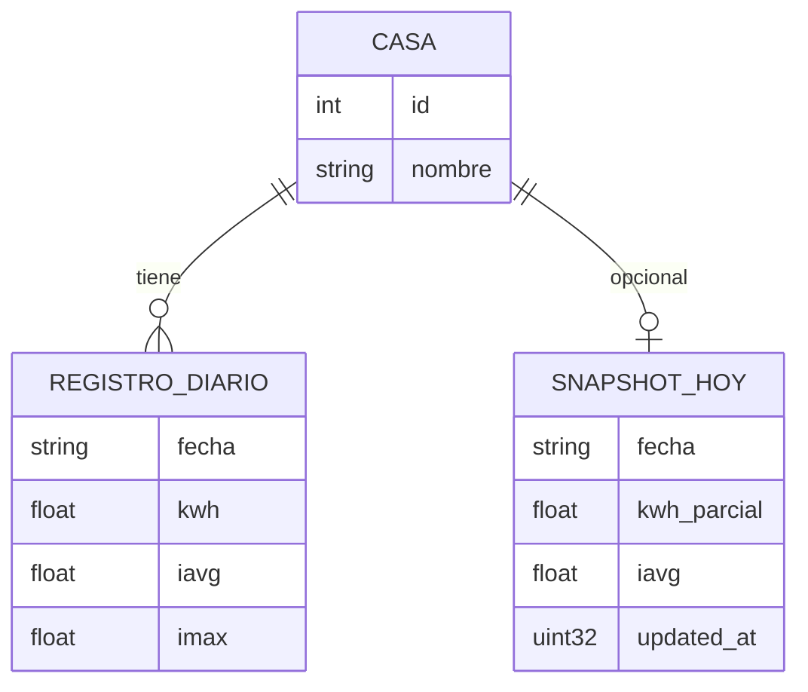
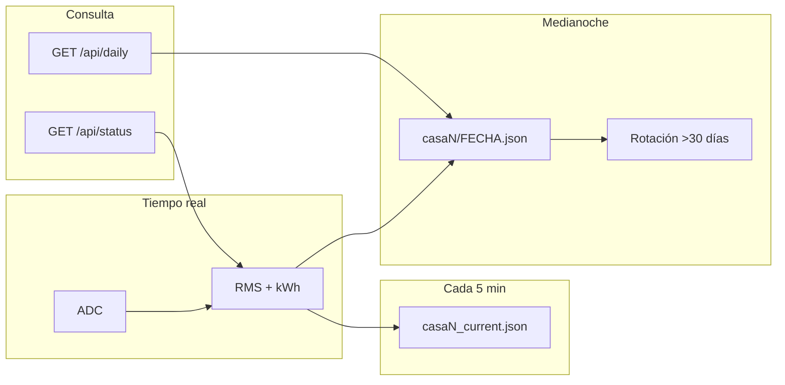

# Almacenamiento y API

## 1. Requisito de retención: 1 mes

Se guardan **agregados diarios por casa**, no cada muestra de ADC. Eso reduce uso de flash y simplifica consultas (“¿cuánto consumió por día?”).

### Estimación de espacio

Por registro diario (JSON compacto):

```json
{"d":"2026-05-18","kwh":12.345,"iavg":5.2,"imax":18.1}
```

~60 bytes × 30 días × 2 casas ≈ **3,6 KB** + archivos del día en curso + margen → **< 100 KB** total.

La flash del ESP32-C3 (4 MB típicos) permite reservar **1–1,5 MB** a LittleFS con amplio margen para 30 días y crecimiento.

---

## 2. Modelo de datos



### Estructura de archivos en LittleFS

```
/data/
├── casa1/
│   ├── 2026-04-19.json
│   ├── ...
│   └── 2026-05-18.json
├── casa2/
│   └── (idem)
├── casa1_current.json    # día en curso, flush cada 5 min
└── casa2_current.json
```

### Formato `YYYY-MM-DD.json`

```json
{
  "casa": 1,
  "fecha": "2026-05-18",
  "kwh": 12.345,
  "iavg": 5.21,
  "imax": 18.07,
  "muestras": 8640
}
```

---

## 3. Política de rotación

Al cerrar un nuevo día:

1. Escribir archivo definitivo `casaN/YYYY-MM-DD.json`.
2. Listar archivos de `casaN/`; si hay más de **30**, eliminar el más antiguo.
3. Truncar `casaN_current.json` o reiniciar contadores.

Pseudocódigo:

```
function rotar(casa_id):
    archivos = listar("/data/casa{casa_id}/")
    ordenar por fecha ascendente
    while count(archivos) > 30:
        eliminar archivos[0]
        archivos.remove_at(0)
```

---

## 4. API REST

Base URL: `http://<ip-del-esp32>/`

### 4.1 `GET /api/status`

Mediciones instantáneas.

**Respuesta 200**

```json
{
  "timestamp": "2026-05-18T14:32:01-03:00",
  "uptime_s": 3600,
  "casas": [
    {
      "id": 1,
      "nombre": "Casa 1",
      "i_rms_a": 4.52,
      "p_w": 994.4,
      "kwh_hoy": 8.21
    },
    {
      "id": 2,
      "nombre": "Casa 2",
      "i_rms_a": 1.10,
      "p_w": 241.9,
      "kwh_hoy": 2.05
    }
  ]
}
```

### 4.2 `GET /api/today`

Solo acumulado del día en curso.

```json
{
  "fecha": "2026-05-18",
  "casa1_kwh": 8.21,
  "casa2_kwh": 2.05,
  "total_kwh": 10.26
}
```

### 4.3 `GET /api/daily`

| Parámetro | Tipo | Default | Descripción |
|-----------|------|---------|-------------|
| `casa` | 1 \| 2 | obligatorio | Identificador de casa |
| `days` | int | 30 | Cantidad de días hacia atrás (máx. 30) |

**Ejemplo:** `GET /api/daily?casa=1&days=30`

```json
{
  "casa": 1,
  "desde": "2026-04-19",
  "hasta": "2026-05-18",
  "registros": [
    { "fecha": "2026-04-19", "kwh": 11.2, "iavg": 4.8, "imax": 15.0 },
    { "fecha": "2026-04-20", "kwh": 10.9, "iavg": 4.6, "imax": 14.2 }
  ]
}
```

### 4.4 `GET /api/config` (solo lectura pública)

```json
{
  "v_nominal": 220,
  "power_factor": 0.95,
  "retention_days": 30,
  "firmware": "0.1.0"
}
```

### 4.5 Errores

| Código | Cuándo |
|--------|--------|
| 400 | Parámetro `casa` inválido |
| 404 | Sin datos para el rango |
| 500 | Error de lectura LittleFS |

---

## 5. Diagrama de flujo de datos (día completo)



---

## 6. Alternativas si se supera 1 mes o se necesita backup

| Opción | Ventaja | Cuándo usarla |
|--------|---------|---------------|
| **microSD** en SPI | Muchos meses/años | Histórico largo local |
| **MQTT + InfluxDB** en Raspberry Pi | Gráficos y backup | Casa con servidor 24/7 |
| **Telegraf + Grafana Cloud** | Dashboards profesionales | Si aceptás dependencia externa |

La **versión 1** del proyecto se centra en LittleFS (sin hardware extra).

---

## 7. Seguridad de la API

- Exposición solo en **red LAN** (sin port forwarding en router).
- Opcional: token en header `X-Api-Key` para escritura/calibración.
- No exponer credenciales WiFi en `/api/config`.

---

## 8. Ejemplo de consulta desde PC

```bash
curl http://192.168.1.50/api/status
curl "http://192.168.1.50/api/daily?casa=1&days=7"
```

En automatización doméstica (Home Assistant): sensor REST con `resource: http://.../api/today` y plantilla JSON.
